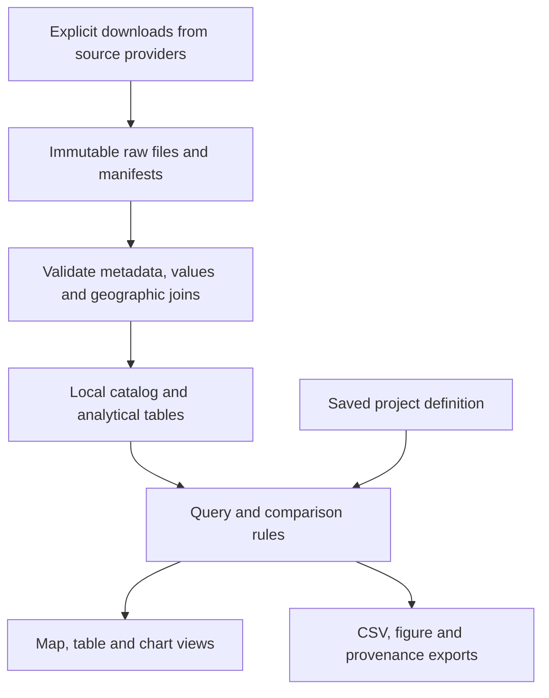

# Social Explorer research and build strategy

Researched 2026-09-20. Status: proposal, not an implemented app or an approved dependency list.

## Recommendation

Build a local census explorer around a reusable data catalog, validated geographic joins, linked map/table/chart views, and reproducible exports. Make NYC the first project and keep the data engine independent of it. The proposed competitive value for this research lab is explicit denominators, visible uncertainty, saved analysis definitions, and specialized historical migration work.

This review used Social Explorer's public product documentation and original data-provider documentation. It did not include a paid-account walkthrough, performance benchmarking, or inspection of Social Explorer's internal architecture. Product claims below are documented capabilities, not independently tested behavior. The public map application did not load through the research browser. Proposed implementation choices are our recommendations, not claims about their technology.

## What Social Explorer offers and what we should build

| Capability documented by Social Explorer | Our implementation proposal | Priority |
| --- | --- | --- |
| Browse data by subject, survey, year, table and variable; save variables [1] | Searchable official metadata with plain-language aliases, units, universe, available periods and geography levels | First release |
| Shading, proportional symbols, dot density, geography selection and styling [1] | One choropleth for rates/shares, with an accessible table and a distinct missing-data style; add symbols for counts later | First release, then expand |
| Side-by-side and swipe comparisons [1] | Linked two-panel views with shared cut points and explicit compatibility checks; swipe later | Second release |
| Geography and variable selection for reports; CSV/Excel exports [2] | Select areas, build a comparison table, export CSV plus metadata; spreadsheet formatting later | First release |
| Map saving, sharing, annotations and stories [1] | Save local project files and figure exports; add annotated story views after results are validated | Save early; stories later |
| Custom uploads, ring/drive-time analysis and geodata downloads [3] | Later additions with documented allocation methods; do not equate a clipped polygon with an exact population count | Deferred |
| Natural-language questions with sources and methodology [4] | Optional future assistant that generates a structured query against the validated catalog | Deferred |

Their data library advertises over 500,000 variables and includes federal sources alongside providers such as EASI and Applied Geographic Solutions [5]. Full catalog parity is outside the initial goal. Obtain our data from original providers or authorized downloads; do not design the pipeline around scraping Social Explorer results. Provider access, redistribution and attribution requirements must be checked dataset by dataset.

Their published plans page lists a restricted free tier and Professional pricing of $195/month monthly or $135/month billed annually [3]. These are reference prices from the page, not a quote or a verified checkout price. A local personal tool avoids a platform subscription for the supported workflows, but requires maintenance and does not replace every licensed dataset or business feature.

## Data sources for our version

| Need | Preferred source | Main constraint |
| --- | --- | --- |
| Modern population and socioeconomic indicators | Census ACS API, starting with 2019-2023 five-year tables | API key for data queries; preserve product, period, table universe, annotations and MOE |
| Current map polygons | Census cartographic boundaries for display; TIGER/Line where detailed geometry is needed [6] | Boundaries contain identifiers, not demographic observations; match geography vintages |
| Historical published statistics and boundaries | IPUMS NHGIS | Availability differs by subject, geography and period; retain codebooks and required citations |
| Historical comparisons on a fixed footprint | Applicable NHGIS standardized series or reviewed crosswalks [7,8] | Coverage is limited and interpolation is an estimate |
| Custom generation, birthplace and economic cohorts | IPUMS USA microdata | Exact variable/sample availability, weights, geographic disclosure and design-based variance |

A crucial limit: NHGIS distinguishes series linked by names/codes from series standardized to fixed boundaries. The former can still change spatial extent. Its documented ready-made standardized tables currently provide selected count statistics, not arbitrary medians, ratios or every birthplace series [7]. Crosswalks are building blocks, not automatic historical comparability.

## First usable version

A single-user local browser application with a NYC project preset:

1. Choose a topic and period from an explicit catalog.
2. Pick NYC, boroughs, or supported census tracts. Start with the five boroughs to validate the pipeline; add tracts before calling the map explorer complete.
3. View a map and synchronized data table. Click a place to inspect its estimate, margin of error, universe and source.
4. Switch between supported counts and shares. A denominator is part of the measure definition, not a cosmetic toggle.
5. Save the selection and export data and a figure with provenance.

Begin with a small approved variable set: the three candidate tables already in project configuration, plus the total-population/nativity denominator tables after verifying their exact cells and compatible universes. Do not advertise unsupported cross-tabulations. Add a second reference period only after a table-definition and boundary review.

Suggested screen layout: topic/variable controls at left, period and geography above the map, a linked table below, and a source/uncertainty drawer for the selected result. Keep technical codes available in the drawer and exports rather than making them the primary navigation. Provide keyboard-operable controls, text labels and a usable table alternative to the map.

The initial map can use local boundary layers without a third-party street basemap. This supports offline replay and avoids introducing a tile service into the first milestone. Bundle browser libraries, fonts and styles locally too; a CDN dependency would break that promise.

## Proposed architecture

Recommended stack, subject to approval before adding dependencies:

- Python for ingestion, validation and historical analysis. Keep provider-specific code separate from measurement definitions.
- DuckDB with Parquet for analytical storage once data volumes warrant it. DuckDB supports querying Parquet with column and filter pushdown [9]. For the tiny first pull, standard-library JSON/CSV is enough; do not introduce a database server.
- A small TypeScript browser interface with MapLibre GL JS for interactive maps. MapLibre documents GeoJSON and vector-tile sources [10]. Use local GeoJSON for NYC first; benchmark before adding a tile build pipeline.
- A local Python service to serve validated queries and assets, bound to loopback. Select its framework when implementation begins. Keys remain on the local service side and never enter browser bundles or exported projects.

React is optional, not a prerequisite. A notebook remains useful for investigation, but the repeatable research workflow should live in tested modules. Defer a multi-user server, cloud database, account system, paid basemap, nationwide tiles and AI service until their benefits are demonstrated.

## Data contracts that make it reusable

The catalog must distinguish a human research concept from a specific source variable. 'Foreign-born share' maps to an explicit numerator, denominator, universe and valid set of releases. Do not assume a matching label means equivalent variables.

Proposed entities:

| Entity | Essential fields |
| --- | --- |
| Source release | Provider, product, reference start/end, release identifier, retrieval timestamp, checksum, source URL, terms/citation |
| Variable | Release-scoped code, label, concept, universe, unit, estimate/MOE/annotation pairing, valid geography levels |
| Geography | Level, identifier as a string, name, boundary vintage, geometry reference, parent geography |
| Observation | Source release, geography, variable, estimate, original flags, MOE/SE status, transformation reference |
| Derived measure | Versioned formula, input variable IDs, denominator, universe, uncertainty method, compatibility rules |
| Saved project | Data manifest IDs, measures, places, periods, geography vintage, filter, cut points, palette, annotations |

Do not store only a 'year' and a value. Separate observation periods from release and boundary vintages. Save data revisions in projects so refreshing the catalog does not silently change old figures. If required cached inputs are missing, report that explicitly instead of fetching replacements during rendering.

## Analytical behavior to get right

- Preserve suppressed/missing/annotated values distinctly from zeros. Pair estimates with valid MOEs; do not interpret Census negative sentinels as measurements.
- Enforce uniqueness before geography joins and report unmatched features and observations. Preserve leading zeroes in FIPS/GEOIDs.
- Aggregate compatible counts, then recompute shares from summed numerators and denominators. Do not sum percentages, average area medians, or treat overlapping areas as disjoint.
- Make common class breaks the default for comparisons. Independent quantile legends can manufacture apparent change. Keep low reliability separate from missingness and magnitude.
- Require compatible survey products, universes and geography. Social Explorer also documents checks for these issues [11]; we should verify them against provider metadata rather than relying on vendor examples as authority.
- Use a visible proposal when changing a requested period, geography or variable. The documented Social Explorer fallback system can substitute alternatives [12]; our saved research query should preserve the requested definition and record any accepted substitution.
- Model crosswalk interpolation uncertainty separately from sampling error. Do not reallocate medians or MOEs as though they were counts.
- Include source, period, universe, geography vintage, method and data hash with every export. Social Explorer's Data Navigator export guide says sources/methodology are displayed separately rather than embedded in its exports [13]; a portable provenance bundle is a useful feature for us.
- A future AI layer may interpret a question and propose a query. Calculations and retrieved values must come from deterministic code, with no guessed values or automatically accepted proxy variables.

## Delivery sequence and acceptance criteria

| Stage | Deliverable | Acceptance criterion |
| --- | --- | --- |
| A. Verified data slice | One product, five boroughs, approved measures, raw cache and manifest | Selected cells reconcile with published Census tables; malformed responses fail visibly; no key leakage; offline replay matches |
| B. Usable local explorer | Borough and tract map, linked table, catalog search, inspect/save/export | Exact joined geography coverage; table and map agree; metadata travels with exports; reopening reproduces the result |
| C. Comparisons and chart | Reviewed second period, linked maps, shared-scale group chart | Products/universes/boundaries checked; fixed cut points; uncertainty and gaps visible |
| D. Historical evidence | Small IPUMS/NHGIS pilot and source reconciliations | Verified group codes, availability matrix and footprint; no unverified historical chart values |
| E. Specialized research | Generations, flows, age and economic sorting | Each study meets the measurement and sample-design requirements in RESEARCH_PLAN.md |

Stages A-C are a modest application engineering project; D-E are open-ended research work and may dominate the schedule. Do not promise a full historical explorer in a weekend. Estimate development effort after the first real pull and tract render establish data volume and integration behavior.

For implementation, create offline tests for sentinel handling, variable drift, cache corruption, duplicate joins, denominators and credential redaction. Then add a small live smoke test as a separate explicitly networked action. Test map/table consistency, project replay and export metadata in the browser. No code or data-pipeline tests were added by this documentation task.

## Sources

1. [Social Explorer: Introduction to Maps](https://help.socialexplorer.com/hc/en-us/articles/24357507229725-Introduction-to-Maps)
2. [Social Explorer: Introduction to Reports](https://help.socialexplorer.com/hc/en-us/articles/25083684247453-Introduction-to-Reports)
3. [Social Explorer plans](https://help.socialexplorer.com/hc/en-us/articles/25084941016221-Social-Explorer-Plans)
4. [What is Data Navigator?](https://help.socialexplorer.com/hc/en-us/articles/33249031280797-What-is-Social-Explorer-Data-Navigator)
5. [Social Explorer data library](https://home.socialexplorer.com/data-library)
6. [Census TIGER/Line](https://www.census.gov/geographies/mapping-files/time-series/geo/tiger-line-file.2024.html) and [2023 cartographic boundaries readme](https://www2.census.gov/geo/tiger/GENZ2023/description.pdf)
7. [NHGIS time series tables](https://www.nhgis.org/time-series-tables)
8. [NHGIS geographic crosswalks](https://www.nhgis.org/geographic-crosswalks)
9. [DuckDB Parquet documentation](https://duckdb.org/docs/lts/data/parquet/overview)
10. [MapLibre examples](https://maplibre.org/maplibre-gl-js/docs/examples/)
11. [Social Explorer multi-year comparison rules](https://help.socialexplorer.com/hc/en-us/articles/33499322029725-Multi-Year-Comparisons)
12. [Social Explorer fallback rules](https://help.socialexplorer.com/hc/en-us/articles/33499635926173-Fallback-Rules)
13. [Social Explorer Data Navigator exports](https://help.socialexplorer.com/hc/en-us/articles/33253739184413-Download-and-Export-Options)

For Census API access and IPUMS documentation, see SOURCES.md. Before expanding scope, verify exact table coverage, specific provider terms, and any new dependency choices. This research does not establish Social Explorer's internal technology, its full normalization methodology, or independent accuracy/performance results.
